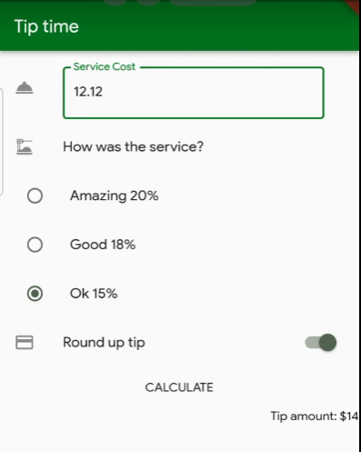

# Tarea 5 | TipTime con Provider

## Temas

- Utilizar colores
- Utilizar iconos
- Utilizar Containers con esquinas redondeadas y colores
- Utilizar textos con style
- Utilizar TextFields con su controller
- Utilizar paddings
- Utilizar columnas y filas y sus alineaciones

## Lo que me costó más trabajo

-Calcular la propina y el watch y read pero fue mas problema que lo solucionamos en clase.

## Lo que aprendí

- mejorar mi provider junto con el read y el watch ademas de los notify listeners.
- Constructores y controladores

## Link a video demostrativo

https://youtube.com/shorts/CUVMzOOYqNM

## Screenshots de la app

## Criterio de evaluación

| Criterio                                                                                                                                   | Puntos Totales | Puntos Obtenidos   |                                 Observaciones |
| :----------------------------------------------------------------------------------------------------------------------------------------- | :------------: | :--------------:   | --------------------------------------------: |
| La app utiliza como color principal el verde.                                                                                              |       10       |        8           |    *20% menos por entrega tardia              |
| La app cuenta con Text fields decorados similares a los de los screenshots en la descripción de la tarea.                                  |       10       |        8           |    *20% menos por entrega tardia              |
| Al presionar los TextFields se muestra el teclado numérico.                                                                                |       10       |        8           |    *20% menos por entrega tardia              |
| La selección de los radios solamente permite una opción a la vez.                                                                          |       25       |        20          |    *20% menos por entrega tardia              |
| Al presionar el botón de calcular se ejecutan los cálculos necesarios y el total se actualiza únicamente con dos decimales.                |       15       |        8           |    *20% menos por entrega tardia              |
| Al activar la opción de redondeo y presionar el botón de calcular el total debe redondear hacia arriba a número cerrado sin decimales.     |       20       |        16          |    *20% menos por entrega tardia              |
| Link al repositorio de github, bitbucket o similar.                                                                                        |       7        |        5.6         |    *20% menos por entrega tardia              |
| Link a video de app funcionando.                                                                                                           |       3        |        2.4         |    *20% menos por entrega tardia              |
| Extras: Se muestra al usuario un diálogo de advertencia si los TextFields se encuentran vacíos y el usuario presiona el botón de calcular. |       3        |        2.4         |    *20% menos por entrega tardia              |