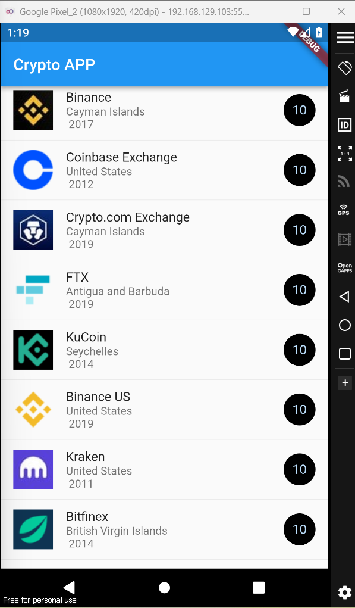

# Tarea 4 - Crypto look

- List View.
- List Tile.
- Cargar datos de un JSON / Mapa.
- Divider

## Lo que me costó más trabajo

- La complicacion mas grande que tuve viene siendo el hecho de ya tener la informacion del JSON como sacarla ya que pensaba que era como un arreglo y ya de ahi agarrar la informacion pero es un json entonces tuve que hacerlo de la manera correcta exchanges[index]["trusted"]7

- Trate de hacer la implementacion del drawer pero por falta de tiempo no la entregare, pero hare un update al repo para esto ya que siento que puede ser de gran ayuda al momento de hacer las practicas.

## Lo que aprendí

- El hecho de obtener informacion localmente para las imagenes, y como plasmarlas, siento que es la manera correcta de tener tu codigo limpio y sin mucho texto que puedes reciclar para que sea facil de entender para cualquier programador que vaya a leer esta tarea.
- Tambien una repasada al Markdown para hacer el README siento que me ayudo mucho para la entrega.

## Screenshots de la app

## Criterio de evaluación

| Criterio                                                              | Puntos Totales | Puntos Obtenidos | Observaciones |
| :-------------------------------------------------------------------- | :------------: | :--------------: | ------------: |
| Incluye README con las caracteristicas que se piden.                  |       30       |        30        |               |
| Se muestran las imágenes en el README                                 |       20       |        20        |               |
| Los elementos de la lista se muestran como en la imagen proporcionada |       30       |        30        |               |
| Se utiliza JSON Decode para convertir el String a objeto de Dart      |       10       |        10        |               |
| Repositorio de GitHub                                                 |       10       |        10        |               |